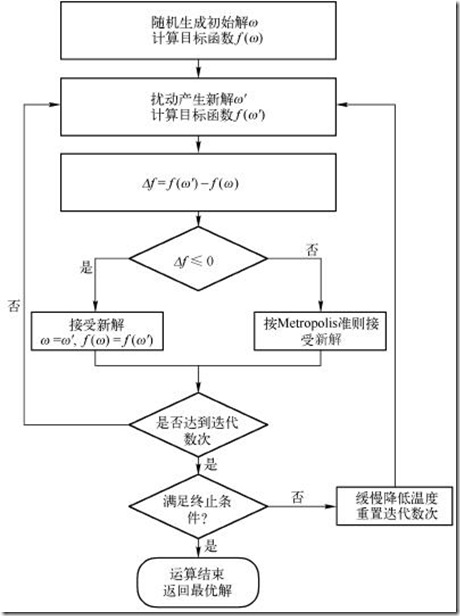
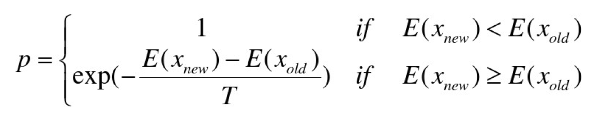
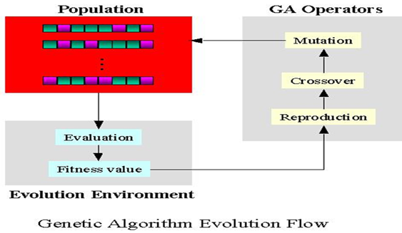

# cdn 解决最优网络流传输分配的服务器选点问题

> 此项目可供参考解决相关网络流问题、运筹学选址规划问题以及物流分发问题

## 问题描述

> 在给定结构的G省电信网络中，为了视频内容快速低成本的传送到每个住户小区，需要在这个给定网络结构中选择一些网络节点附近放置视频内容存储服务器。需要解决的问题是：在满足所有的住户小区视频播放需求的基本前提下，如何选择视频内容存储服务器放置位置，使得成本最小。

## 问题模型

> 网络结构模型：给定一个由若干网络节点（例如路由器、交换机）构成的网络结构无向图，每个节点至少与另外一个节点通过网络链路相连（网络链路特指两个网络节点之间直接相连的网络通路，中间没有其他网络节点，相当于无向图中的一条边），一个节点可以将收到的数据通过网络链路传输给相连的另一个节点。每条链路的网络总带宽不同（例如某条链路的总带宽为10Gbps）。而每条链路承载的视频传输需要按照占用带宽的多少收取对应网络租用费，每条链路的单位租用费均不同（例如某条链路的租用费为1,000元/Gbps，即1K/Gbps）。某条链路上被占用的带宽总和不得超过该链路的总带宽。

> 消费节点：给定的网络结构中有部分网络节点直接连接到小区住户的网络，每个小区住户网络在这个给定的网络结构图中呈现为一个消费节点，不同消费节点的视频带宽消耗需求不同。

> 视频内容服务器：视频内容服务器存放视频内容（如：电影影片、电视剧等），视频内容服务器的视频数据流可以经由网络节点与链路构成的网络路径流向消费节点，视频内容服务器的输出能力没有上限，可以服务多个消费节点，一个消费节点也可以同时从多台视频内容服务器获取视频流。部署一台视频内容服务器需要费用成本（例如300,000元/台，即300K/台），所有服务器的成本均相同。

## 需求

> 从网络结构模型中选择一部分网络节点，在其上/附近一对一的部署视频内容服务器，视频内容服务器与对应的这个节点直连，与对应的这个网络节点之间的通信没有带宽限制、也没有通信成本。提供的部署方案需要使得视频流从视频内容服务器经过一些网络节点和链路到达消费节点，并满足所有消费节点的视频带宽消耗需求。

> 在满足所有消费节点视频带宽消耗需求的前提下，使得耗费的总成本（视频内容服务器部署成本+带宽租用成本）最低。部署方案不仅需要包括部视频内容服务器的节点位置，而且还要包括每个消费节点与所有视频内容服务器之间的网络路径以及路径上占用的带宽。 


# 整体思路：

* 先解决CDN位置确定时的最小费用最大流问题

 > 使用MCMF(最小费用最大流)算法，加入超级源点和超级汇点的思想:超级源点连接设定好的CDN（为了方便，接下来服务器都会被简称为CDN），超级汇点连接所有的消费节点所连接的网络节点，并且保证所有消费节点连接到超级汇点的链路带宽即为其带宽需求。至此，当确定某几个节点为CDN时，可以求出最大流为且只能为固定值时的最小费用问题，所以接下来我们只需要想方法来确定CDN位置。


* 先模拟退火，然后再对优解做遗传进化
> 采用从直连解法为种子，进行模拟退火，启发式搜索，在退火过程中加大抖动力度，让搜索范围更全局，而非陷入某个局部最优。之后，将模拟退火的解作为祖先，进行交叉变异，遗传进化，快速迭代出更优秀的解。


## 数据结构设计
```C++

 //某网络节点作为服务器时的最大提供带宽
 //序号为服务器所连的节点号，值为评估带宽
    vector<int> ServeAroundBandwidth;

 //所有节点的评估带宽存储
 //插入时，级按带宽权重排序，以便后续退火出优解提供更好的候选节点
    set<SeverNoAndAroundBandwidth, Bandwidth_From_Small_To_Big> AllNodeAroundBandwidth;

 //消费节点连接的网络节点编号
    set<int> ConsumerNum;

 //网络节点编号索引相连消费节点带宽
    map<int, int> NodesLinkConsumerNeed;

 //网络节点编号索引相连消费节点序号
    map<int, int> NodesLinkConsumerNO;

struct SeverNoAndAroundBandwidth
{
    int ServerNo;
    int ServeAroundBandwidth;
};

struct server
{
    vector<int> serverNO;//一共net_node,bit来对染色体进行编码
    double bandwidths;
    int num_of_sercers;
    double fit;//适应值
    double rfit = 0;//相对的fit值，即所占的百分比
    double cfit = 0;//积累概率
    int cost = INT_MAX;

    bool operator<(const server &m) const
    {
        return fit < m.fit;
    }
};

struct SeverSetAndCost
{
    set<int> SetSeverNO;//服务器编号集合
    int cost;//对应的成本
};

struct Bandwidth_From_Small_To_Big
{
    bool operator()(const SeverNoAndAroundBandwidth &left, const SeverNoAndAroundBandwidth &right) const
    {
        return (left.ServeAroundBandwidth < right.ServeAroundBandwidth);
    }
};


//链路信息(双向)
struct LinkInfo
{
    int total_bandwidth = 0;
    int network_hire = INT_MAX;
};

//消费节点信息结构体
struct ResumeInfo
{
    int node_NO;//消费节点连接的网络节点编号
    int need_bandwidth;//需求带宽
};


```


## 模拟退火算法流程


## 模拟退火数学模型

> 根据Metropolis准则，粒子在温度T时趋于平衡的概率为exp(-ΔE/(kT))，其中E为温度T时的内能，ΔE为其改变数,k为Boltzmann常数。Metropolis准则常表示为



> &emsp;&emsp;Metropolis准则表明，在温度为T时，出现能量差为dE的降温的概率为P(dE)，表示为：P(dE) = exp( dE/(kT) )。其中k是一个常数，exp表示自然指数，且dE<0。所以P和T正相关。这条公式就表示：温度越高，出现一次能量差为dE的降温的概率就越大；温度越低，则出现降温的概率就越小。又由于dE总是小于0（因为退火的过程是温度逐渐下降的过程），因此dE/kT < 0 ，所以P(dE)的函数取值范围是(0,1) 。随着温度T的降低，P(dE)会逐渐降低。
&emsp;&emsp;我们将一次向较差解的移动看做一次温度跳变过程，我们以概率P(dE)来接受这样的移动。也就是说，在用固体退火模拟组合优化问题，将内能E模拟为目标函数值 f，温度T演化成控制参数 t，即得到解组合优化问题的模拟退火演算法：由初始解 i 和控制参数初值 t 开始，对当前解重复“产生新解→计算目标函数差→接受或丢弃”的迭代，并逐步衰减 t 值，算法终止时的当前解即为所得近似最优解，这是基于蒙特卡罗迭代求解法的一种启发式随机搜索过程。退火过程由冷却进度表(Cooling Schedule)控制，包括控制参数的初值 t 及其衰减因子Δt 、每个 t 值时的迭代次数L和停止条件S。


## 退火策略

* 1、先对数据量（节点数量）进行分类，分为大、中、小三类
* 2、各个类型下，进行不同的退火策略，具体策略及其执行概率见下方
```C++
if (consumer_nodes > 300)
    {
//大型数据
//随机删除一个服务器,小型数据
        a1 = 35;
//随机添加一个服务器,小型数据
        a2 = 35;
//随机按比例删除服务器，中大型数据
        a3 = 100;
//随机按比例增加服务器，中大型数据
        a4 = 100;
//优先删除所能提供带宽最小的服务器
        a5 = 100;
//优先添加所能提供带宽最大的服务器
        a6 = 100;
//完全产生新服务器
        a7 = 100;
//随机添加t1个服务器,再随机删除t2个服务器
        a8 = 100;
//添加一个最大服务器,再删除最小的服务器
//a8~100

    } else if (consumer_nodes > 100)
    {
//中型数据
//随机删除一个服务器,小型数据
        a1 = 70;
//随机添加一个服务器,小型数据
        a2 = 100;
//随机按比例删除服务器，中大型数据
        a3 = 100;
//随机按比例增加服务器，中大型数据
        a4 = 100;
//优先删除所能提供带宽最小的服务器
        a5 = 100;
//优先添加所能提供带宽最大的服务器
        a6 = 100;
//完全产生新服务器
        a7 = 100;
//随机添加t1个服务器,再随机删除t2个服务器
        a8 = 100;
//添加一个最大服务器,再删除最小的服务器
//a8~100
    } else
    {
//小型数据
//随机删除一个服务器,小型数据
        a1 = 70;
//随机添加一个服务器,小型数据
        a2 = 100;
//随机按比例删除服务器，中大型数据
        a3 = 100;
//随机按比例增加服务器，中大型数据
        a4 = 100;
//优先删除所能提供带宽最小的服务器
        a5 = 100;
//优先添加所能提供带宽最大的服务器
        a6 = 100;
//完全产生新服务器
        a7 = 100;
//随机添加t1个服务器,再随机删除t2个服务器
        a8 = 100;
//添加一个最大服务器,再删除最小的服务器
//a8~100
    }
```

## 退火后的优化解进行遗传进化，快速出解


